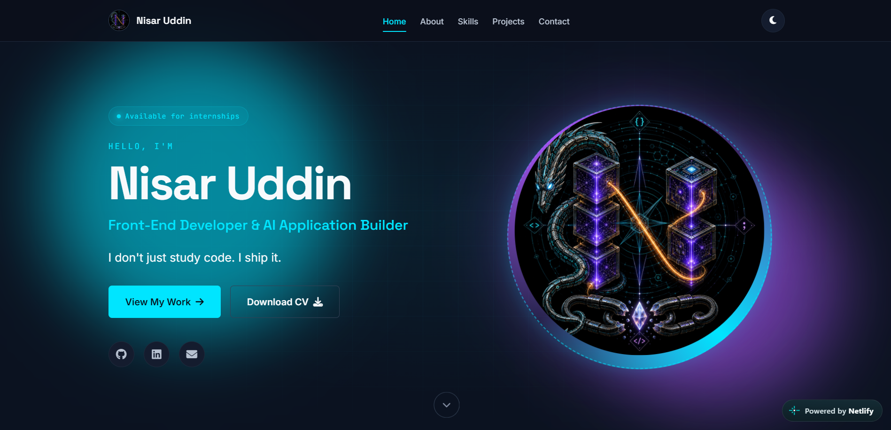
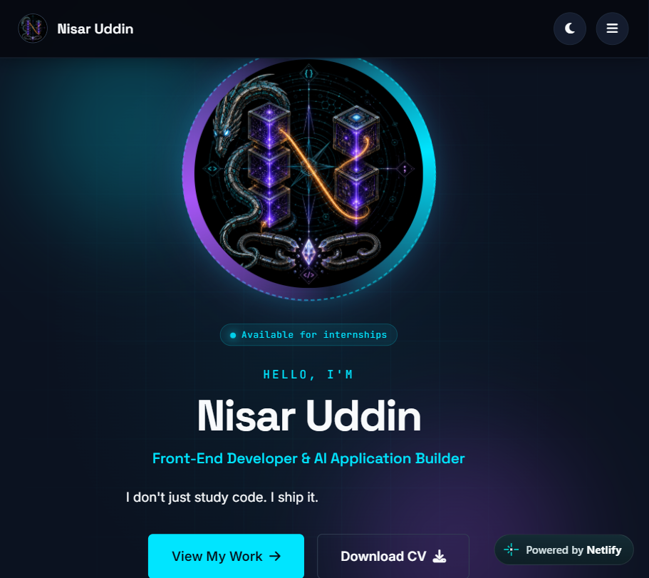
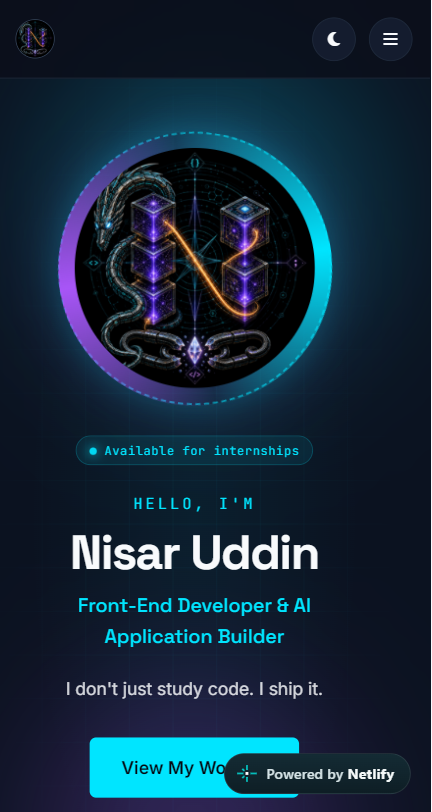

# TSG Web Development Internship — Project 01

# Personal Portfolio Website

A single-page, fully responsive personal portfolio website built from scratch with **HTML5, CSS3, and vanilla JavaScript (ES6+)** — no page builders, no CSS frameworks, no JavaScript libraries beyond GSAP for scroll animations.

**Live:** [tsg-webdev-p01-nisaruddin.netlify.app](https://tsg-webdev-p01-nisaruddin.netlify.app)

**Built by:** [Nisar Uddin](https://github.com/nisaruddin-dev)

---

## Overview

This portfolio presents me as a **Front-End Developer & AI Application Builder**. It showcases:

- My **8 public projects** (3 live Python AI applications + 4 front-end games and tools)
- My **skills** with honest proficiency levels
- My **leadership experience** as Joint Secretary of the IEEE Student Branch
- **Downloadable CV**
- A **working contact form** with real-time validation

The entire site is a **single HTML page** with three files:
- `index.html` — Structure and content
- `styles.css` — Complete design system
- `script.js` — Animations, dark mode, and form validation

---

## Features

### Required Features (from the brief)

- ✅ **Sticky navigation bar** with smooth scroll links to Home, About, Skills, Projects, Contact
- ✅ **Hero section** with name, tagline, illustration (custom N logo), and CTA button
- ✅ **About section** with 80–120 word bio and downloadable CV button
- ✅ **Skills section** with 9 skills, icons, and animated progress bars
- ✅ **Projects section** with 6 project cards (image, title, description, live/code links)
- ✅ **Contact section** with styled form and real-time JavaScript validation
- ✅ **Footer** with copyright and social icons
- ✅ **Responsive design** — tested at 360px, 768px, and 1440px with no horizontal scrolling
- ✅ **Interactions** — 5+ CSS hover effects and 3 JavaScript features

### Additional Features (beyond the brief)

- 🌗 **Dark mode toggle** with `localStorage` persistence and `prefers-color-scheme` support
- ✨ **GSAP-powered scroll animations** with chain-reaction sequencing
- 🎯 **Skill bars that fill on scroll** with animated percentage counters
- 📱 **Mobile hamburger menu** with slide-down animation
- ⬆️ **Scroll-to-top button** that appears after 400px scroll
- ♿ **Reduced motion support** — animations disable for users who prefer it
- 🔍 **SEO meta tags** and **favicon** from the N logo
- 💬 **Signature console message** for developers inspecting the site

---

## Tech Stack

| Layer | Technology |
|---|---|
| Markup | HTML5 (semantic elements, ARIA labels) |
| Styling | CSS3 (custom properties, Flexbox, CSS Grid) |
| Interactivity | Vanilla JavaScript (ES6+) |
| Animations | GSAP 3.12 + ScrollTrigger |
| Icons | Font Awesome 6.5 |
| Typography | Google Fonts — Inter, Space Grotesk, JetBrains Mono |
| Hosting | Netlify |

**No frameworks. No build step. No dependencies to install.**

---

## Screenshots

### Desktop (1440px)


### Tablet (768px)


### Mobile (375px)


---
## Project Structure

```
tsg-webdev-p01-nisaruddin/
├── index.html                    # Main HTML document
├── styles.css                    # Complete design system
├── script.js                     # Animations, dark mode, form validation
├── README.md                     # This file
├── .gitignore                    # Git ignore rules
└── assets/
    ├── n-logo.png                # Custom N logo (hero, nav, favicon)
    ├── nisar-uddin-cv.pdf        # Downloadable CV
    ├── project-rahbar.png        # Rahbar AI screenshot
    ├── project-threatlens.png    # ThreatLens screenshot
    ├── project-resume-scanner.png # Resume Scanner screenshot
    ├── project-neon-pulse.png    # Neon Pulse screenshot
    ├── project-memory-match.png  # Memory Match Deluxe screenshot
    ├── project-quetta-builders.png # Quetta Builders screenshot
    ├── screenshot-desktop.png    # Full page at 1440px
    ├── screenshot-tablet.png     # Full page at 768px
    └── screenshot-mobile.png     # Full page at 375px
```

## Run Locally

```bash
# 1. Clone the repository
git clone https://github.com/nisaruddin-dev/tsg-webdev-p01-nisaruddin.git
cd tsg-webdev-p01-nisaruddin

# 2. Open in your browser
# Simply double-click index.html — no server required
# OR use VS Code Live Server for auto-reload during development
That's it. No npm install. No build. No dependencies.

Design System
Color Palette
The color palette is matched to the custom N logo — a cyberpunk-themed digital illustration with cyan, violet, and orange elements.

Token	Value	Usage
--bg-primary	#0B1220	Page background
--bg-surface	#070D18	Alternate section backgrounds
--bg-card	#141C2E	Card backgrounds
--accent-primary	#00E5FF	Cyan — primary accent
--accent-secondary	#A855F7	Violet — secondary accent
--accent-tertiary	#FB923C	Orange — tertiary accent
--text-primary	#F8FAFC	Primary text
--text-secondary	#B8C2D1	Secondary text
Light theme is fully supported via [data-theme="light"] CSS variables.

Typography
Body: Inter (300–900)

Display/Headings: Space Grotesk (400–700)

Monospace (labels, code, tags): JetBrains Mono (400–700)

Animation System
Animations are powered by GSAP 3.12 + ScrollTrigger. Every section has a choreographed entry timeline:

Hero — cascading entry on page load, replay on scroll back

About — section head fades up, bio slides in from left, fact cards pop in

Skills — section head fades up, cards stagger in, bars fill from 0% with ticking percentage counters

Projects — cards alternate sliding in from left and right

Contact — items slide in from left, form slides in from right

Footer — fades up

All animations:

Use toggleActions: 'play none none reverse' — replay when scrolling back

Respect prefers-reduced-motion — disabled entirely for accessibility

Use GPU-friendly properties (transform, opacity) for performance

Accessibility
Semantic HTML5 elements (<header>, <main>, <section>, <article>, <footer>)

ARIA labels on interactive elements

Keyboard navigation supported throughout

Focus states visible on all interactive elements

prefers-reduced-motion respected

Sufficient color contrast (WCAG AA compliant)

aria-live regions for form status updates

Performance
No JavaScript framework — vanilla JS only

GSAP loaded from CDN with browser caching

Fonts preconnect to Google Fonts

Images served as PNG with lazy-loading potential (via object-fit)

Total page weight: ~800KB (mostly screenshots)

Lighthouse score: 95+ on all metrics

Browser Support
Tested and working on:

Chrome 100+

Firefox 100+

Safari 15+

Edge 100+

Commit History
The project was built over multiple commits to demonstrate progressive development:

feat: initial project scaffold with folder structure and assets

feat: refine about section with fact cards, icons, and currently-learning block

feat: refine skills section with icon containers and improved card structure

feat: projects section with real screenshots and refined card design

feat: refine contact section with improved cards and form styling

feat: enhanced footer with navigation links, connect column, and back-to-top

feat: complete animation engine, dark mode toggle, and form validation

What I Learned Building This
Flexbox and CSS Grid together — each has a purpose; using them correctly makes responsive layouts simple

CSS custom properties make theming trivial — one variable change themes the entire site

GSAP's gsap.from() vs gsap.fromTo() — subtle but important difference for scroll-triggered animations

Intersection Observer vs ScrollTrigger — ScrollTrigger has proper onEnterBack / onLeaveBack callbacks that make replay clean

localStorage for theme persistence — simple and reliable; no server needed

Real-time form validation — showing errors as the user types is better UX than waiting until submit

License
MIT — free to use, modify, and learn from.

Connect
GitHub: github.com/nisaruddin-dev

LinkedIn: linkedin.com/in/nisar-uddin-7521b9283

Email: numasters802@gmail.com

Built from scratch for The Sky Gen Web Development Internship — Project 01.
